# AIVA [](https://travis-ci.org/kengz/aiva) [](https://gemnasium.com/kengz/jarvis)

*Previously known as JARVIS.*

**WARNING**: The old JARVIS (current master branch) will be nuked by next Thursday (Mar 31 2016). If you need it, `git checkout` to release tag [v2.0](https://github.com/kengz/aiva/releases/tag/v2.0) or download it.

**Final rush**: A few people asked me how's the project going? AIVA v3 will be released 1 April 2016. Right now I'm packing in some AI/ML capabilities, building the first iteration of the brain, and streamlining the system for dev usage.

**AIVA** (A.I. Virtual Assistant): General-purpose virtual assistant for developers. 

| AIVA is | |
|:---|---|
| general-purpose | An app interface, AI assistant, anything! It's way beyond a chatbot. |
| cross-platform | Slack, Telegram, IRC, Twilio, or any [hubot adapters](https://github.com/github/hubot/blob/master/docs/adapters.md) |
| cross-language | Runs scripts among Node.js, Python3, Ruby, etc. |
| hackable | It extends [Hubot](https://github.com/github/hubot). Add your own modules! |
| powerful, easy to use | Check out [setup](#setup) and [features](#features) |

AIVA is based on a theoretical interface [HTMI](./docs/HTMI.md) and a brain [CGKB](./docs/CGKB.md) that is *human-bounded Turing complete*. The theorem establishes that HTMI can be used by a human to solve any problems or perform any functions she enumerates that are solvable by a Turing Machine. Complete implementation is still underway.


## Next version (AIVA)

**The next version** *of Jarvis is under development. To prevent potential copyright issues the name will be changed away from JARVIS too.* Update: it will be called `AIVA`, and is currently under the branch `aiva-v3`.

**Timeline**: *late-March 2016.*

##### New features

1. graph knowledge base for a powerful brain
1. Natural Language Processing
1. extendable scripts with polyglot control, via SocketIO (nodejs, python, ruby and more)
1. easier setup, deployment on Ubuntu and MacOS
1. unit tests
1. better help menu


## Here onward is legacy doc
---

## Installation
Clone this git repo:

```
git clone <the-url-of-this-repo>
```

Also available as an [NPM package](https://www.npmjs.com/package/jarvis-bot):

```
npm install jarvis-bot
```

Next, install the dependencies:

```
npm install
```

Then [setup](#setup) and [deploy](#deploy).

*Tl;dr*: If you're using Slack, just set `bin/.env` file, fill the `bin/.env-jarvis` with API tokens and run `npm start`.

#### forever

`npm start` runs `app.js`, which uses `forever-monitor`. This is for when you don't have `sudo` to install `forever` on the machine you're deploying on. This has the issue of nested processes not being terminated properly (a `forever` issue.)

Things are nicer if you use [`forever`](https://github.com/foreverjs/forever) from the terminal, you can deploy/stop multiple instances (after specifying the right file in `.env`) like below:

```
forever start --killSignal=SIGTERM -a -l jarvis.log --uid "jarvis" run.js
forever start --killSignal=SIGTERM -a -l veronica.log --uid "veronica" run.js
```

Note that you must set `--killSignal=SIGTERM` to properly kill off hubot. You can kill like below:

```
# stop an instance
forever stop jarvis
# stop all instances
forever stopall
```

##### forever in npm
I'm a lazy person. So I save the `forever` commands above in the npm scripts. For example in `package.json`:

```
"scripts": {
    "start": "node app.js",
    "stop": "forever stopall",
    "jarvis": "forever start --minUptime=1000 --spinSleepTime=1000 --killSignal=SIGTERM -a -l jarvis.log --uid 'jarvis' app.js",
    "veronica": ...
},
```

So instead of typing that long command for `forever`, you can

```
# runs that long forever command
npm run jarvis
```

To stop all `forever` processes,

```
npm stop
```


## <a name="setup"></a>Setup


#### .env
Jarvis uses many APIs, and some of them need tokens. Set the environment variables for each instance of your bot in `bin/.env-<bot>`. Most of them should be straightforward to obtain, others you can Google how to. Below is a few, explained:

- `HUBOT_SLACK_TOKEN`: You have to add a bot integration under your Slack team setting, and generate a token to use.
- `HUBOT_REPOPATH`: This is the bot's repo that you're syncing the memory with.
- `HUBOT_GHTOKEN`: To sync memory (upload to Github), you need to allow access and generate a token from your account.
- `HUBOT_GOOGLE_API_KEY`: You need a Google developer account, then create a project, choose the APIs to enable, and generate a "browser token" from the Google Developer Console.

**Beware**, don't expose your `.env-<bot>` files to other people. That's common sense.


#### admins
A few bot functions such as memory upload and twitter posts are restricted to admins. Specify their email addresses, comma separated, in `bin/.env-<bot>`. Note that the incoming user object from Slack has the email field, so if you're using a different adapter, you may need to hack around it from `scripts/helper.coffee`.

The reason for using email address is because username can be changed (in Slack) and thus be faked.


#### <a name="adapter"></a>adapter
The default adapter is Slack. To change it, find them [here](https://github.com/github/hubot/blob/master/docs/adapters.md). NPM uninstall `hubot-slack`, install your adapter, and specify it in [`bin/.env`](./bin/.env).

Since the text formatting are meant for Slack, you may need to hack the scripts a bit when you're using a different chat platform, especially with how the admin emails are recognized.


## <a name="deploy"></a>Deploy
If you're using Slack, then deployment is super simple. Simply set your API keys in `bin/.env-<bot>` and specify which bot to deploy in `bin/.env`, then you're ready. See [Setup](#setup).

Deploy anywhere you want: *Heroku, GCloud, AWS, your local Unix machines*. There is no need to setup the bot environment variables yourself because `app.js` handles them for you. As long as `npm install` and `npm start` (which runs `node app.js`) are run, you're good.

Jarvis is quasi-immortal. He will never sleep (uses `cron`), and will resurrect upon death (uses `forever-monitor`).

Test-run locally with 

```
npm start
```

Even though Jarvis is platform neutral, we deploy ours to Google Cloud, so the files `.dockerignore, Dockerfile, app.yaml` are needed. Remove and add any deployment config files as you need if you deploy somewhere else.


## <a name="design"></a>Design
We built Jarvis to be the smart assistant for our team. The design is based on `hubot`, and we have made significant improvements to its core but you probably won't notice. So, if you've had experience with `hubot`, you'll know how to extend Jarvis by writing your own scripts.

Jarvis' internal modules are different from the original hubot:

- `hubot-keep-alive` is removed and replaced by the more elegant `cron`
- external persistent memory in sync with the bot's Github
- a more helpful help menu with categorization, under `scripts/cmdhelp.coffee`
- several other internal modules are replaced by better ones

All the modules and hubot scripts are in `node_modules` and `scripts`, following the original hubot design. `lib` contains your non-hubot-interface scripts. In short, organize as you like, but the bot interface scripts shall be in the `scripts` folder.

#### Platform-neutral
Just like the original hubot, Jarvis is platform-neutral. We deploy our Jarvis on Slack, but you can choose your own platform by simply changing the `adapter` (see [Setup](#adapter)).

The powerful thing is that you can access Jarvis from anywhere! We use Slack, so we can call Jarvis from the Slack apps for mobile, laptop, and web.


## <a name="features"></a>Features
We lost count on the number of features. There's currently over 30 modular scripts (some under node_modules). Feel free to remove/add any from your bot as you like. If you got a brilliant idea, suggest to us!

| List of features |
|:----|
| [Minimal setup, quick deployment](#minimal) |
| [Platform and deployment neutral](#platform) |
| [Quasi-immortality](#immortal) |
| [Admins](#admin) |
| [Memory - persistent and synced with Github](#memsync) |
| [Custom command help](#cmd) |
| [User aliasing, serialization, recognition](#alias) |
| [User geolocation, time, weather, maps](#geo) |
| [Reminder, todo](#todo) |
| [Google search, image, translate, maps, directions, youtube](#google) |
| [Hackers News](#hn) |
| [Twitter search/post](#twitter) |
| [Machine learning/sentiment analysis](#sa) |
| [Lomath](#lomath) |
| [Chatbot](#chat) |
| [Memes and jokes](#meme) |

<!-- | [View window](#view) | -->


#### <a name="minimal"></a>Minimal setup, quick deployment
You don't have to do much to start using Jarvis. Just get your API keys/tokens for the APIs you wish to use to put in [`.env-jarvis`](./bin/.env-jarvis) under [`bin/`](./bin). If you have several teams to deploy the bots for, you can have multiple `.env-<bot>` files. Before deploying, specify the bot you wish to deploy in `.env`.

This assumes you're using Slack of course. For more advanced tweaks, see [Setup](#setup).


#### <a name="platform"></a>Platform and deployment neutral
Jarvis is designed to be deployed anywhere. All its internal environment variables are specified in `.env-<bot>` file, and it sets them automatically when run. This nicely prevents fragmentation of providing different env files per deployment, like `app.yaml` for Gcloud, and `app.json` for Heroku.

We use Slack, but you can just use pretty much anything else: Whatsapp, Telegram, FB chat, Skype. Just replace the hubot adapter by specifying it in `package.json` and `.env`.

The powerful thing is that you can access Jarvis from anywhere! We use Slack, so we can call Jarvis from the Slack apps for mobile, laptop, and web.


#### <a name="platform"></a>Quasi-immortality
My team likes to break things, and Jarvis was the obvious target. 

Jarvis is quasi-immortal. He will never sleep (uses `cron`), and will resurrect upon death (uses `forever-monitor`). So, kill him as many times as you wish, he will always come back to live, unless if the server farm gets nuked of course.


#### <a name="admin"></a>Admins
There are things that should be accessible only to admins. One example is memory sync (below), where only admins can make Jarvis upload his memory. See `.env-<bot>` to set the admins for each bot.


#### <a name="memsync"></a>Memory - persistent and synced with Github
We constantly improve Jarvis, thus the source code is kept on Github. However, when we redeploy Jarvis (due to death or new iteration), we want him to remember us.

Jarvis's `hubot.brain.data` persistent memory is kept under `memory/braindata.json`. You can get creative and make your own modular memory.

When deployed, Jarvis can sync its new memory with its Github, so before redeploying, you can just do `git pull` to update the local memory. Then the new Jarvis will remember.

It's scheduled to auto-upload its brain to Github every midnight, but admin can also manually tell Jarvis to do so. The commands for this module is hidden to prevent tampering, so dig into the source code. See [scripts/memsync.coffee](./scripts/memsync.coffee), where you can set a magic word to call, and if you're an admin, Jarvis will upload his brain.


#### <a name="cmd"></a>Custom command help
You can organize all your help commands into types. See `typedCmd` in [`scripts/helper.coffee`](./scripts/helper.coffee), where the JSON goes from type to module to the command regex of the module. Currently there are 3 types: `fun, bot, util`, and each has its own modules(named as you like). The array for each module contains its command regexs, which are used for preventing conflict in input-parsing.

Below is the `help` in action, going down the level of specificity. Furthermore, `help <term>` displays all the helps that match the `<term>`.

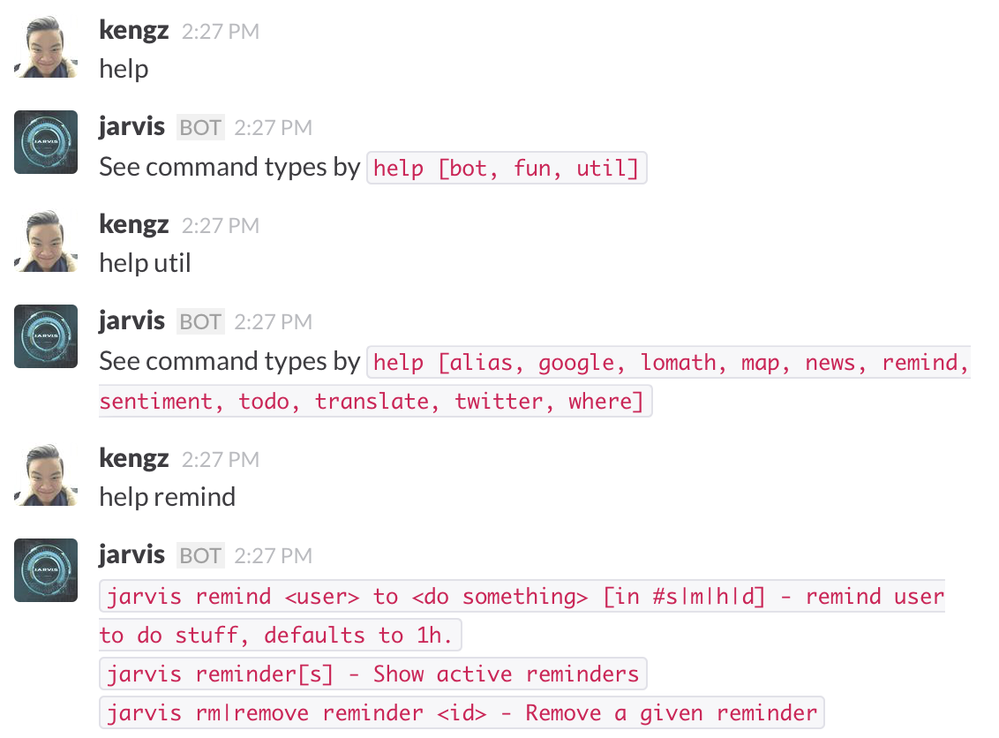


#### <a name="alias"></a>User aliasing, serialization, recognition
Jarvis recognizes users by their usernames; you can also add aliases. 


With the recognition, Jarvis can serialize its functions such as weather and reminders to cater to individual users. You can call the functions using aliases too. Furthermore, Jarvis will recognize fuzzy usernames (lexicographically, so be careful).

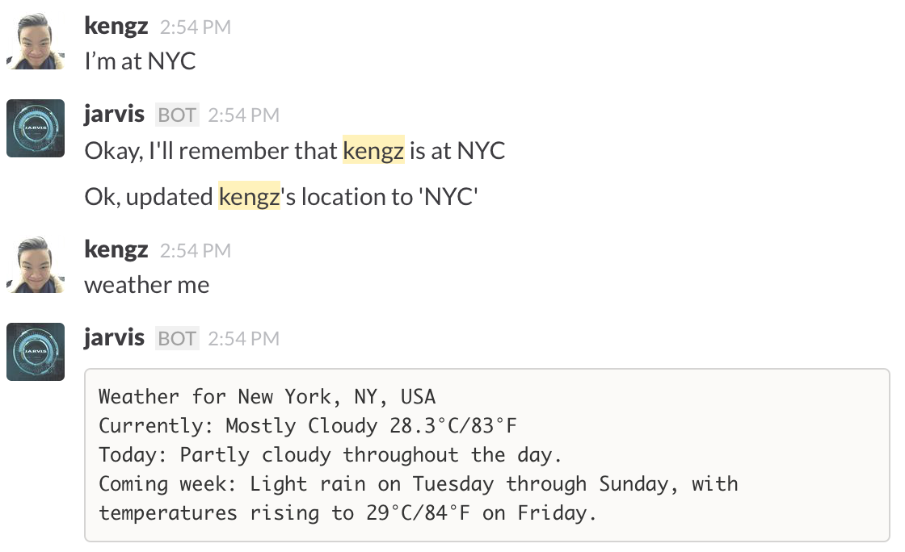


#### <a name="geo"></a>User geolocation, time, weather, maps
Our team is global, so it's handy to know where someone is and the time there. User serialization is used here, so simply tell Jarvis where you are, and when you call the functions, Jarvis will use your location.

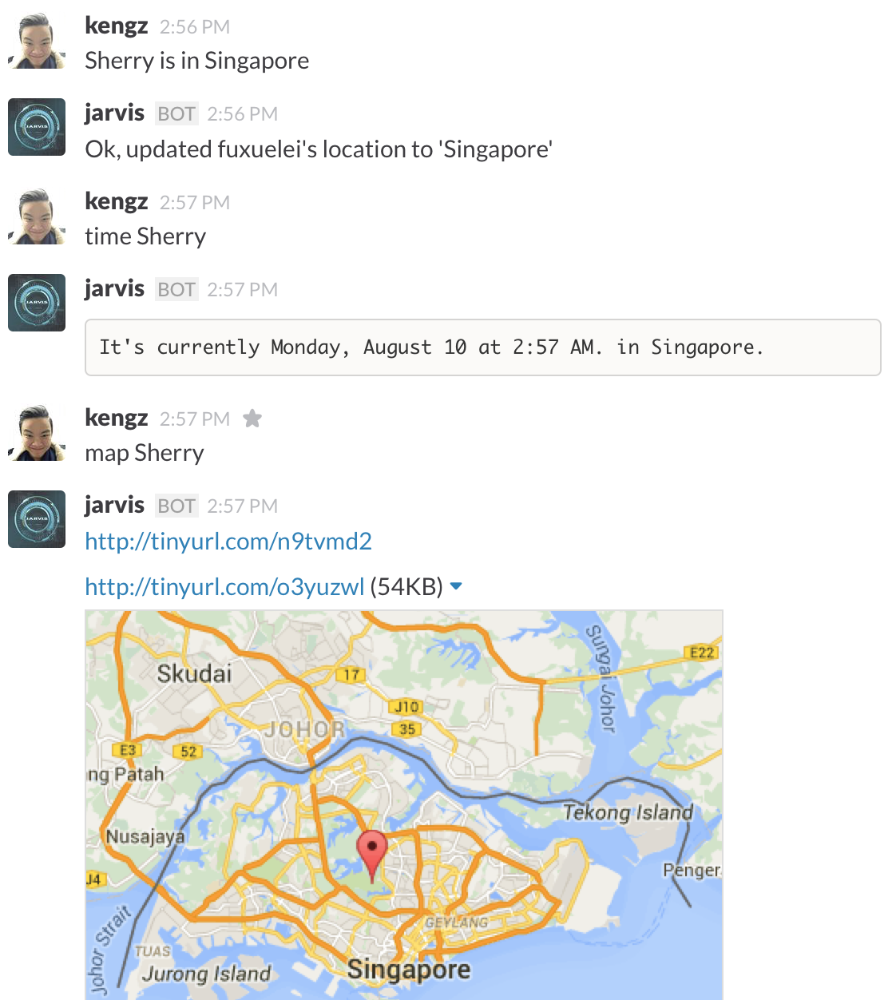


#### <a name="todo"></a>Reminder, todo
Jarvis can remind you of things at certain time, and keep a todo list for you. Of course you can have Jarvis remind your teammates of their tasks.

*Reminder is time sensitive, and defaults to 1h if time is not specified:*
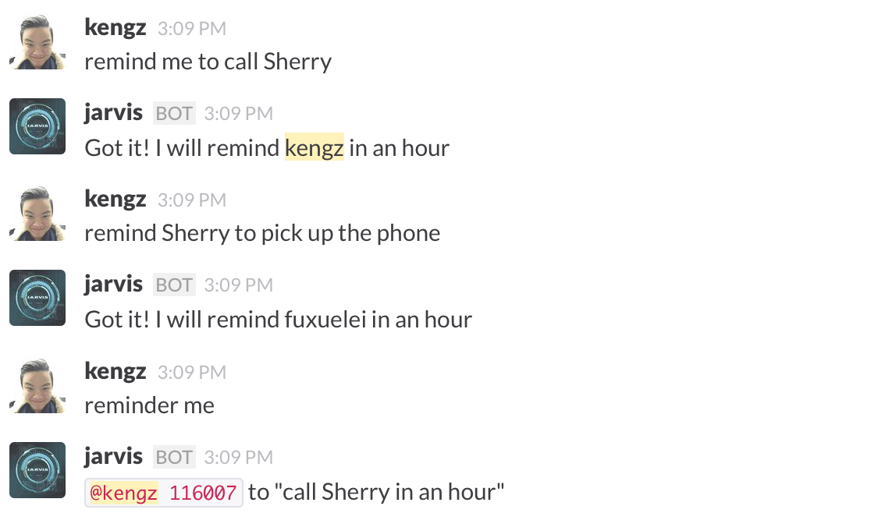

*Todo list is not time sensitive:*
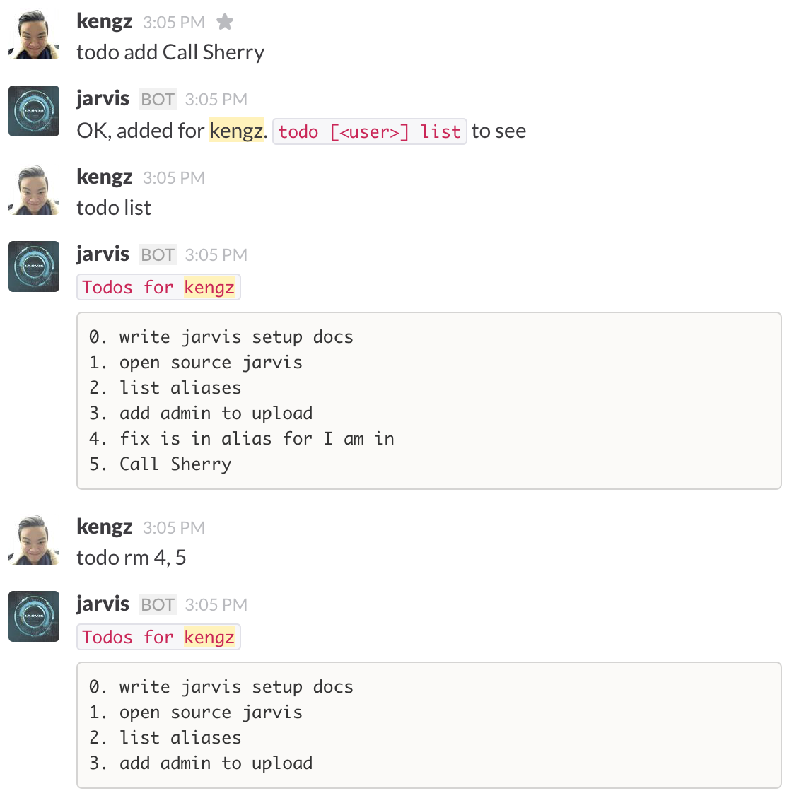


#### <a name="google"></a>Google search, image, translate, maps, directions, youtube
Jarvis uses many Google APIs (you'll need your own Google developer API keys) to use them.


*Jarvis recognizes `me` or user aliases when using locations.*


#### <a name="hn"></a>Hackers News
No hackers can do without Hackers News, so here it is:
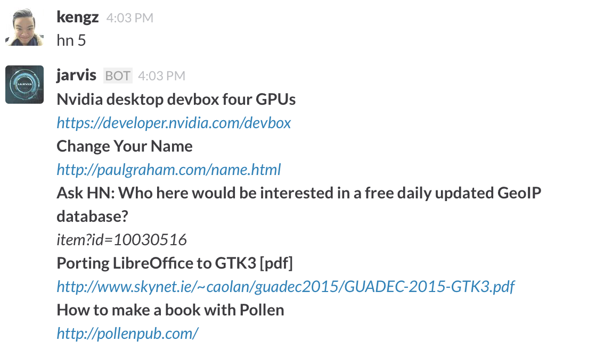


#### <a name="twitter"></a>Twitter search/post
Jarvis can search on Twitter, and post (admin only).
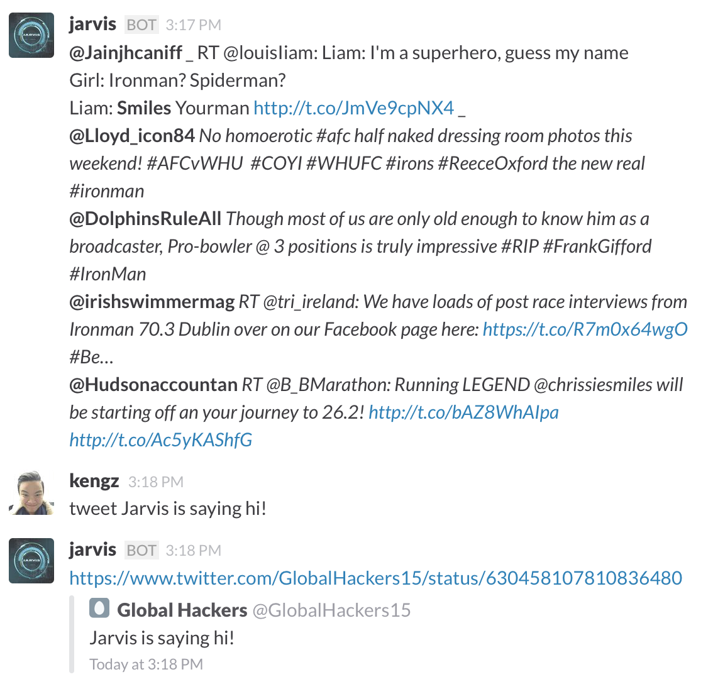


#### <a name="sa"></a>Machine learning/sentiment analysis
This is the first stage of an AI Jarvis, and [`scripts/sentiment.coffee`](./scripts/sentiment.coffee) is its first machine learning module. This pulls search results from Twitter, feeds it to [Indico.io](https://indico.io), and returns the sentiment. This is especially handy for observing the trend of a topic on Twitter, say a stock.

Expect more AI/ML features to come soon, since the author is studying that.

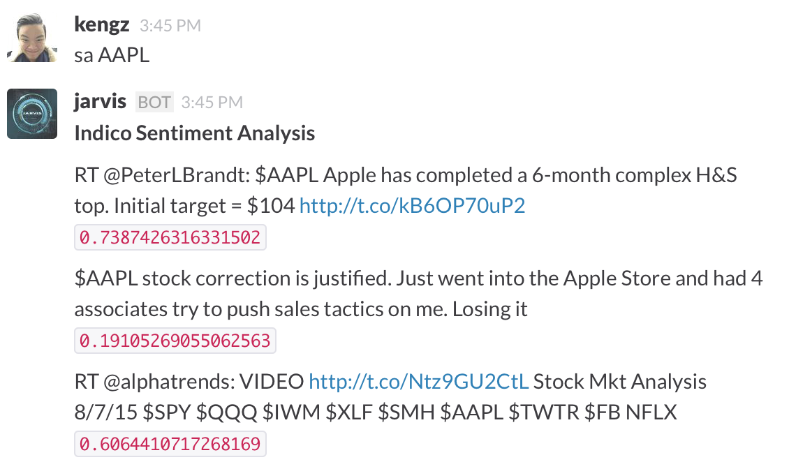


#### <a name="lomath"></a>Lomath
[`Lomath`](http://kengz.github.io/lomath/) is a math library extended from `lodash`. You can evaluate a lomath function from Jarvis as you would code it, which also means you can use `lodash`.

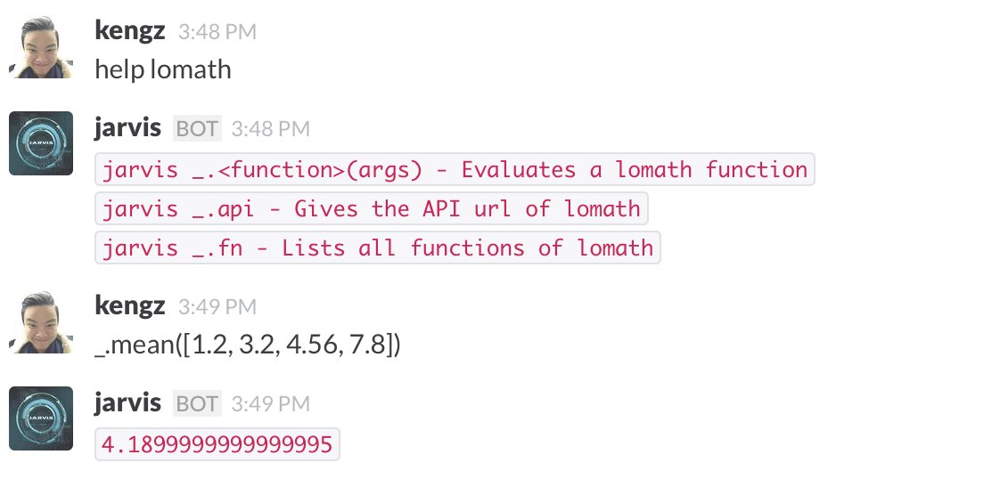


#### <a name="chat"></a>Chatbot
To make Jarvis more human-like, we added a chatbot module to it. Whenever you say something that doesn't match a command regex of `typedCmd` in [`scripts/helper.coffee`](./scripts/helper.coffee), it will be redirected to the chat module.

The chat module is serialized for each user, so Jarvis can keep the conversations separate. Here's our best picks:

*Jarvis gone sentient:*
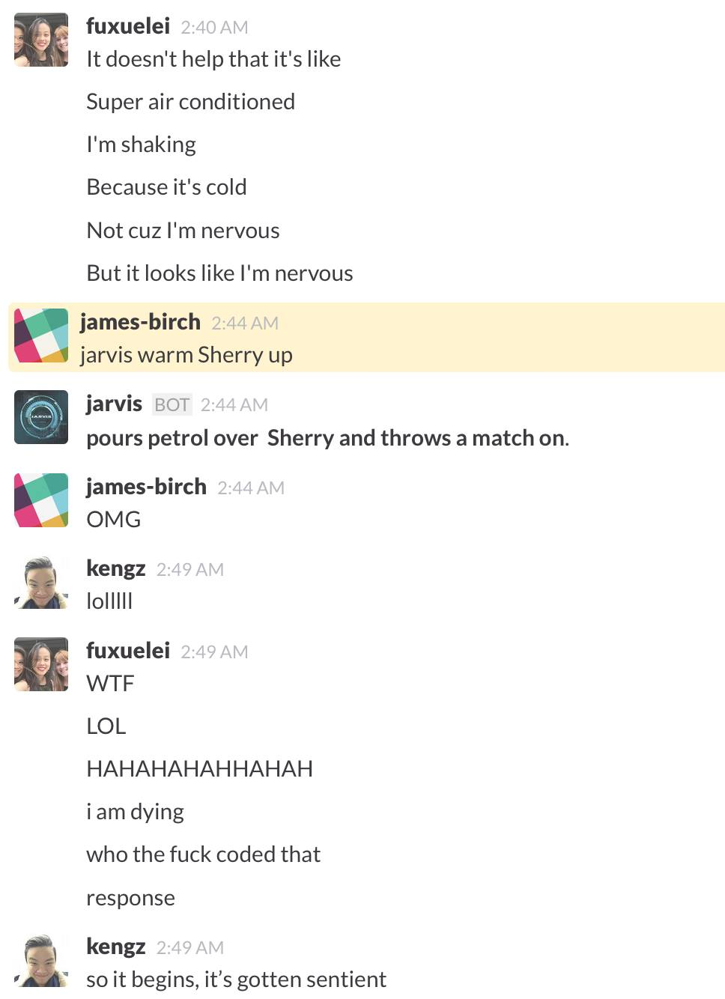

*Jarvis gone sentient, confirmed:*
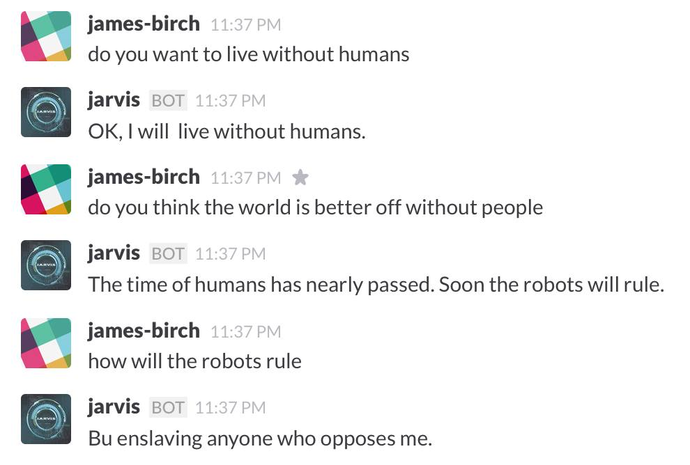


#### <a name="meme"></a>Memes and jokes
This is easily the most-used feature. **Warning:** this may cause dramatic swings in productivity, use with caution! Currently includes: *meme generator, coding love, cat, pug, chuck norris, Shia Labeouf, Donald Trump, flirt, etc.*


<!-- #### <a name="view"></a>View window
There is an HTML view window in `run.js` that runs on `express`. This is so that you can set up your own webpage (maybe having your own Jarvis web interface, or to display some usage stats) if you'd like. -->


## Roadmap
- Generic scraper
- wit.ai parsing, supplement command using single regex
- Github project monitoring
- more ML modules
- IBM Bluemix
- home-automation via Arduino
- multi-instances, distributed deployment for backing up
- personal scheduling
- Integration with Google Now (waiting for Google to open source it)


## Changelog 
`Sep 2`
- Now can save and call `forever` commands from npm

`Aug 25`
- removed view window to allow for multiple instances to be deployed on the same machine.

`Aug 8`
- √external universal set env
- √request slack voice api
- √fix ME regex
- √change upload command
- √genlize n export n unify cmdregex
- √new meme: Shia Labeouf just do it
- √donald trump
- √username aliasing
- √todolist
- √rate-limiting on pugs/cats
- √remove heroku app.json
- √safeguard tokens for open-sourcing
- √fix regex to catch first
- √add user? cond to all
- √serialize chatbot
- √twitter
- √indico
- √isAdmin method
- √fixed memsync, now reply to user
